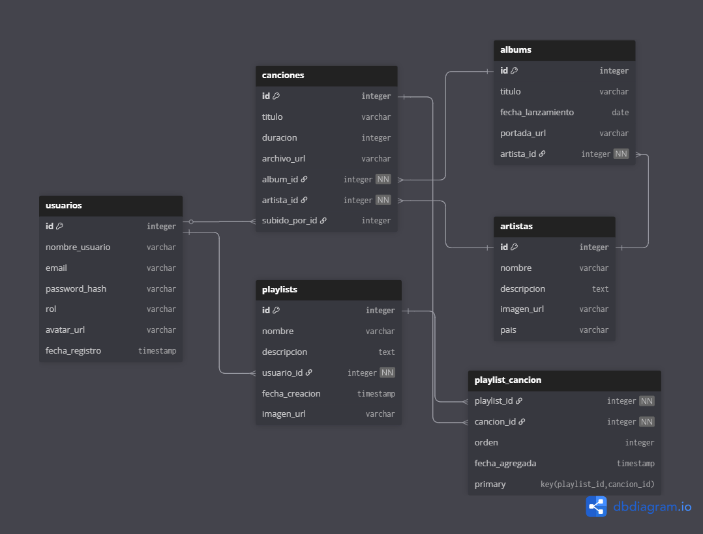

# Streaming de Música | Laboratorio 2 - Proyecto Final

Aplicación web desarrollada con **ASP.NET Core MVC**, inspirada en Spotify en donde los usuarios podrán registrarse, escuchar música, crear playlists y administrar contenido según su rol.



---

## Tecnologías

- **ASP.NET Core MVC**
- **Entity Framework Core**
- **PostgreSQL**
- **Vue.js**
- **TailwindCSS**
- **JWT (JSON Web Tokens)** para autenticación API
- **ASP.NET Identity** para gestión de usuarios y roles

---

## Modelo de base de datos

### Tablas principales

- **Usuarios** → Roles (`Admin`, `Artista`, `Usuario`), avatar, credenciales.
- **Artistas** → Información de artistas musicales.
- **Álbumes** → Asociados a artistas.
- **Canciones** → Asociadas a álbumes y artistas, con archivo de audio.
- **Playlists** → Creadas por usuarios.
- **PlaylistCancion** → Tabla intermedia N:N entre playlists y canciones.

### Relaciones

```
Usuario (1) ───< Playlist (N)
Usuario (1) ───< Cancion (N)
Artista (1) ───< Album (N)
Album (1) ───< Cancion (N)
Playlist (N) ───< PlaylistCancion >─── (N) Cancion
```

---

## Seguridad

- **ASP.NET Identity** para registro y autenticación.
- **Roles**:
  - `Admin`: gestiona artistas, álbumes y canciones.
  - `Artista`: carga sus propias canciones y álbumes.
  - `Usuario`: crea playlists y reproduce canciones.
- **JWT**: autenticación para consumir la API desde clientes externos.

---

## Funcionalidades principales

| Funcionalidad      | Descripción                                                            |
| ------------------ | ---------------------------------------------------------------------- |
| Registro / Login   | Autenticación con ASP.NET Identity                                     |
| Paginado           | Listas de canciones, artistas y álbumes con paginado del lado servidor |
| Búsqueda AJAX      | Buscar canciones o artistas sin recargar la página                     |
| Playlists          | Creación, edición y reproducción de playlists                          |
| Subida de archivos | Canciones, portadas y avatares                                         |
| Roles y permisos   | Funcionalidades restringidas a administradores                         |
| API con JWT        | Endpoints protegidos para obtener canciones y playlists                |

---

## Autores

- Gomez Jacqueline Estefanía
- Godoy Santiago

Laboratorio de Programación II - Universidad de La Punta
